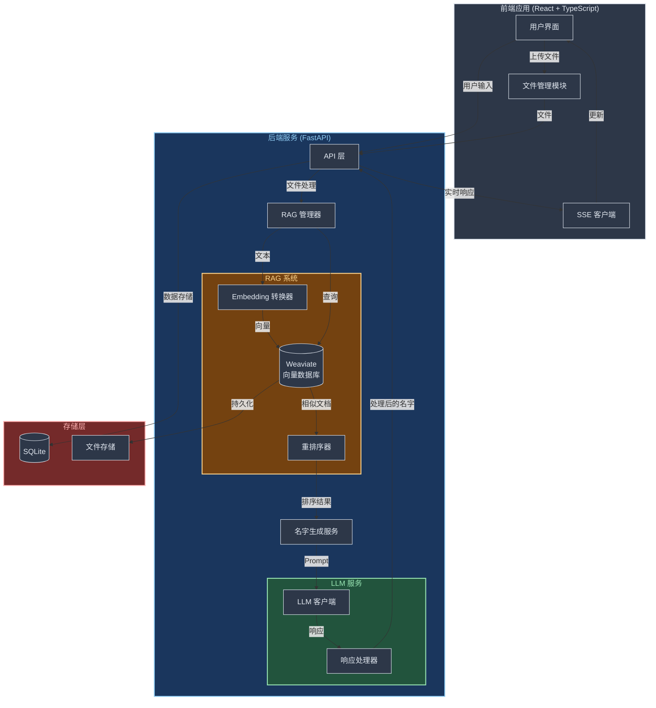

# 新生儿起名助手

一个基于 AI 的中文新生儿起名工具，支持根据性别、寓意、文化来源等条件生成符合要求的名字。

## 系统架构



### 架构说明

1. **前端应用**

   - 用户界面：处理用户输入和展示结果
   - 文件管理模块：处理文件上传和预处理
   - SSE 客户端：处理实时生成结果的展示

2. **后端服务**

   - API 层：处理 HTTP 请求和响应
   - 名字生成服务：核心业务逻辑
   - RAG 管理器：协调 RAG 系统各组件

3. **RAG 系统**

   - Embedding 转换器：将文本转换为向量
   - Weaviate 向量数据库：存储和检索文本向量
   - 重排序器：优化相似度搜索结果

4. **LLM 服务**

   - LLM 客户端：与 LLM API 交互
   - 响应处理器：处理和格式化 LLM 响应

5. **存储层**
   - SQLite：存储用户配置和生成历史
   - 文件存储：保存用户上传的文件和向量数据

### RAG 工作流程

1. **文档处理阶段**

   - 用户上传文本文件
   - 系统将文本分块并通过 Embedding 模型转换为向量
   - 向量数据存入 Weaviate 数据库

2. **名字生成阶段**

   - 系统根据用户输入进行向量检索
   - 重排序器对检索结果进行优化
   - 将相关文档内容融入 Prompt
   - LLM 生成符合文风的名字

3. **质量控制**
   - 使用重排序机制确保检索结果相关性
   - 实时更新向量数据库
   - 支持增量学习和文档更新

## 功能特点

- 🌈 美观的用户界面，支持亮色/暗色主题切换
- 🔍 可选择性别（男孩/女孩/不限）
- 📚 多种文化来源（四书五经、诗经楚辞、唐诗宋词等）
- 💡 丰富的寓意选择
- 🎯 支持自定义寓意导入
- ⚡️ 实时生成名字（Server-Sent Events）
- 📋 一键复制名字及释义
- 🚫 支持回避字和回避读音设置
- 🎨 响应式设计，优雅的滚动效果

## 技术栈

### 前端

- React + TypeScript
- Ant Design 组件库
- Vite 构建工具
- Server-Sent Events 实时通信

### 后端

- FastAPI 框架
- SQLAlchemy ORM
- OpenAI API 集成
- SQLite 数据库

## 环境要求

- Node.js 16.0 或更高版本
- Python 3.9 或更高版本
- 包管理工具：npm 或 yarn（前端）、pip（后端）

## 安装和运行

### 后端设置

1. 进入后端目录：

   ```bash
   cd backend
   ```

2. 创建并激活虚拟环境（可选但推荐）：

   ```bash

   # Windows

   python -m venv venv
   .\venv\Scripts\activate

   # macOS/Linux

   python3 -m venv venv
   source venv/bin/activate

   ```

3. 安装依赖：

   ```bash
   pip install -r requirements.txt
   ```

4. 配置环境变量：

   - 复制 `.env.example` 为 `.env`
   - 在 `.env` 文件中设置您的 OpenAI API 密钥和其他必要配置

5. 启动后端服务：

   ```bash

   # Windows

   python -m uvicorn app.main:app --reload

   # macOS/Linux

   python3 -m uvicorn app.main:app --reload

   ```

### 前端设置

1. 进入前端目录：

   ```bash
   cd frontend
   ```

2. 安装依赖：

   ```bash
   npm install

   # 或者

   yarn install

   ```

3. 启动开发服务器：

   ```bash
   npm run dev

   # 或者

   yarn dev

   ```

4. 在浏览器中访问：
   - 默认地址：http://localhost:3000

### Docker 启动

```bash
# 构建和启动所有服务
docker-compose up -d --build

# 查看服务日志
docker-compose logs -f
```

## 使用说明

1. 选择性别（可选）
2. 选择期望寓意（必选，可多选）
3. 可选择上传自定义寓意文件（txt 格式，每行一个寓意）
4. 选择文化溯源（必选，可多选）
5. 调整生成数量（3-20 个）
6. 设置需要回避的字或读音（可选）
7. 点击"生成名字"按钮开始生成
8. 可以通过右上角的按钮切换亮色/暗色主题

## 开发说明

### 构建生产版本

前端构建：

```bash
cd frontend
npm run build

# 或者

yarn build
```

### API 文档

启动后端服务后，可以访问以下地址查看 API 文档：

- Swagger UI: http://localhost:8000/docs
- ReDoc: http://localhost:8000/redoc
